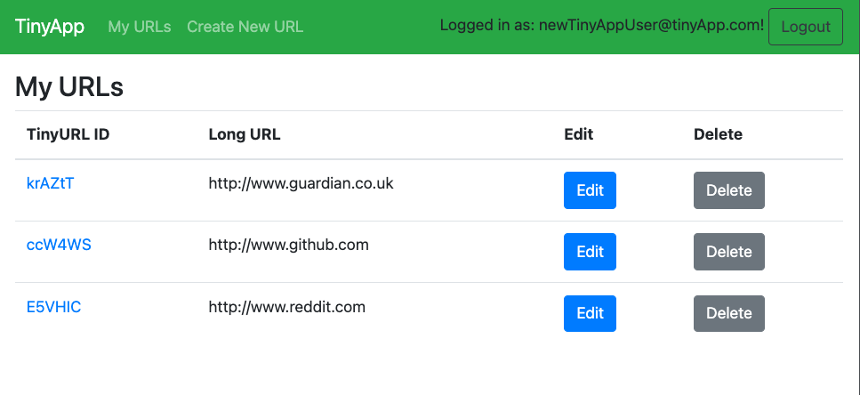
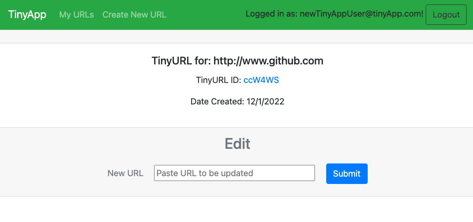
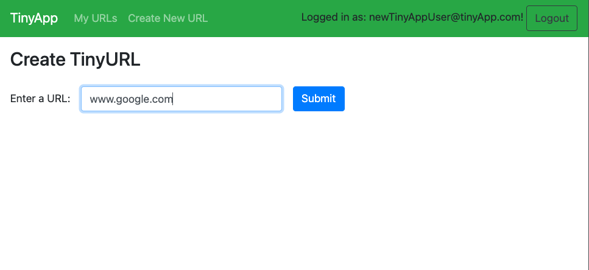
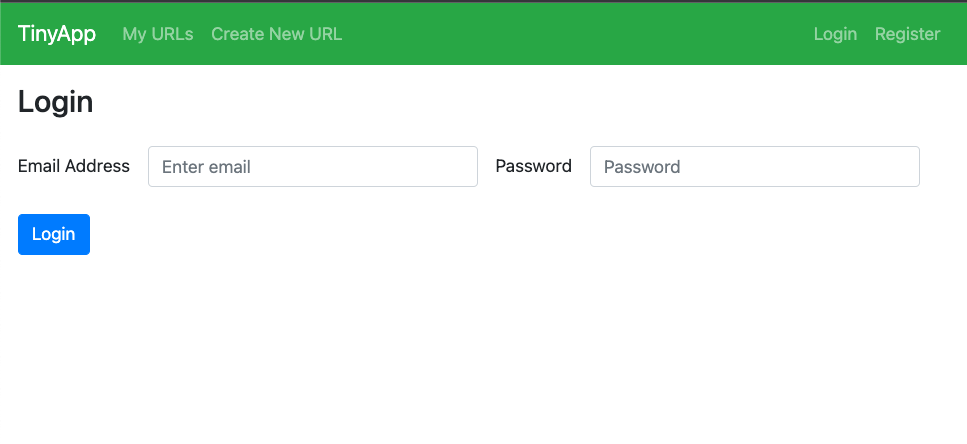

# TinyApp Project

TinyApp is a full stack web application built with Node and Express that allows users to shorten long URLs (à la bit.ly).

---
## Final Product

---
## Dependencies

- Node.js
- Express
- EJS
- bcryptjs for password encryption
- cookie-session for encryption
- method-override using `app.delete` and `app.put`

### Helpful extras
- Mocha/Chai for unit testing
- nodemon for automatic server restarts
---
### Contents
1. [Express Server aka where the magic happens](/express_server.js)
2. [View pages for EJS rendering](/views)
3. [Helper functions](/helperFunctions.js)
4. [Databases for URLs and Users](/database.js)
5. [Mocha/Chai Unit Testing](/test)
    
---
### Getting Started

- Install all dependencies (using the `npm install` command).
- Run the development web server using the `node express_server.js` command.
- Register an account, create new submissions for TinyURLs
- Manage TinyURLS, edit or delete as needed
---
#### Acknowledgements

This project was completed in 4 days during the @lighthouse-labs [Web Development Bootcamp](https://www.lighthouselabs.ca/en/web-development-bootcamp).

